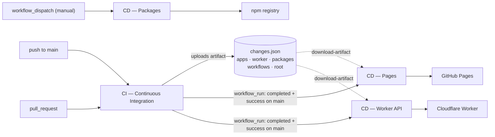
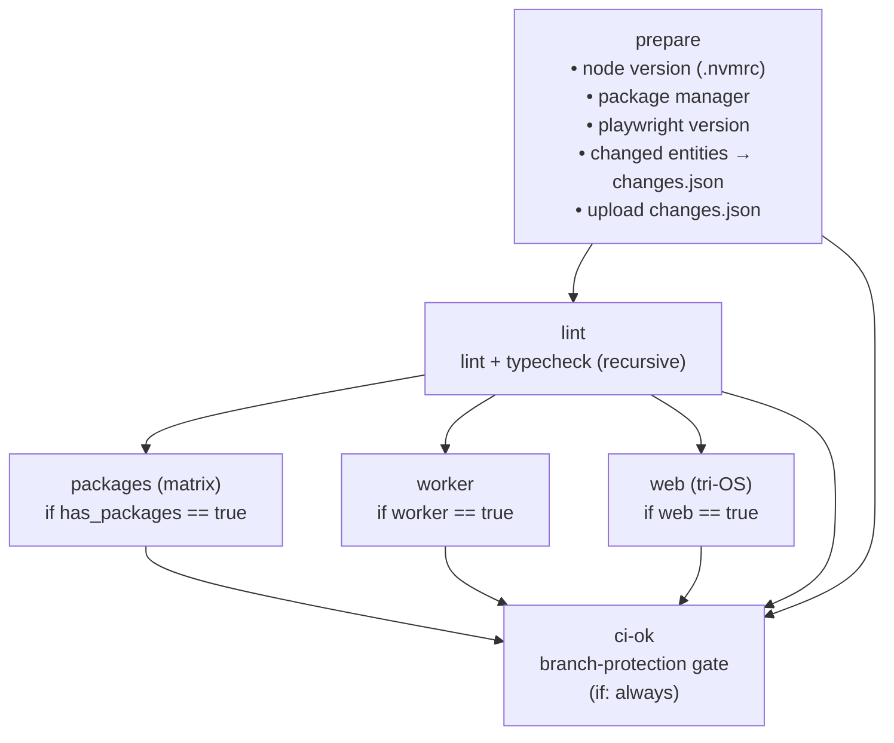
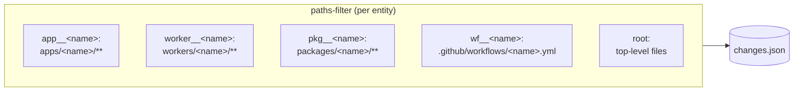
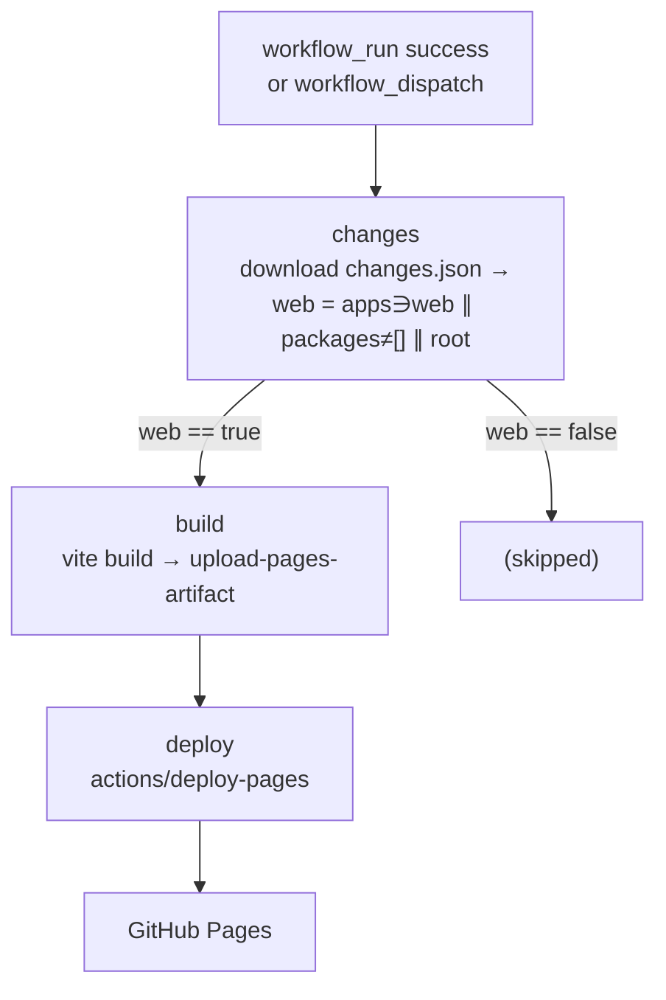
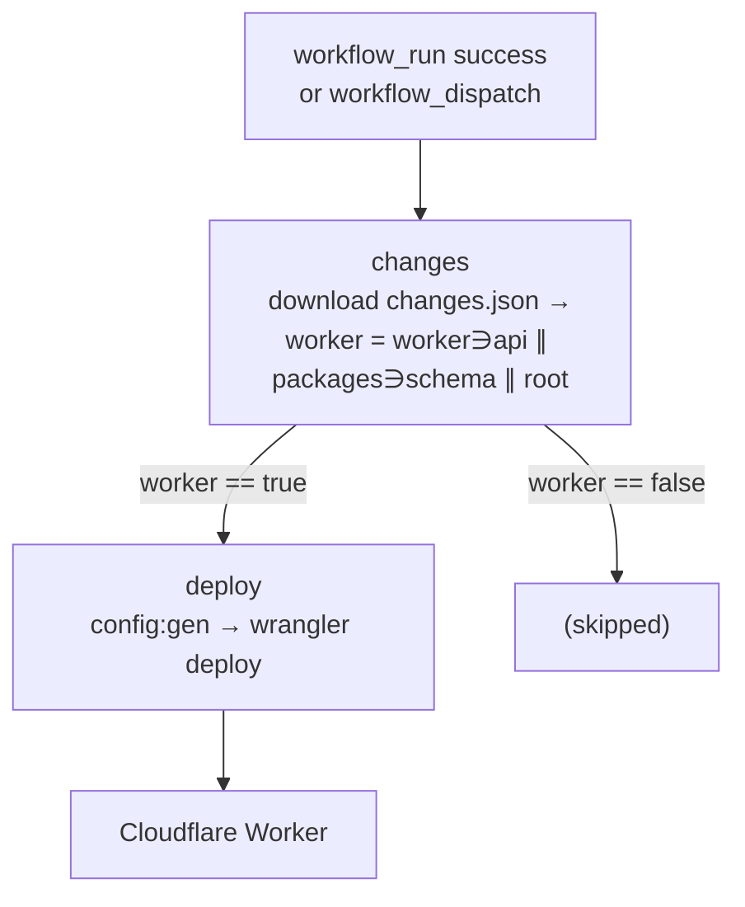
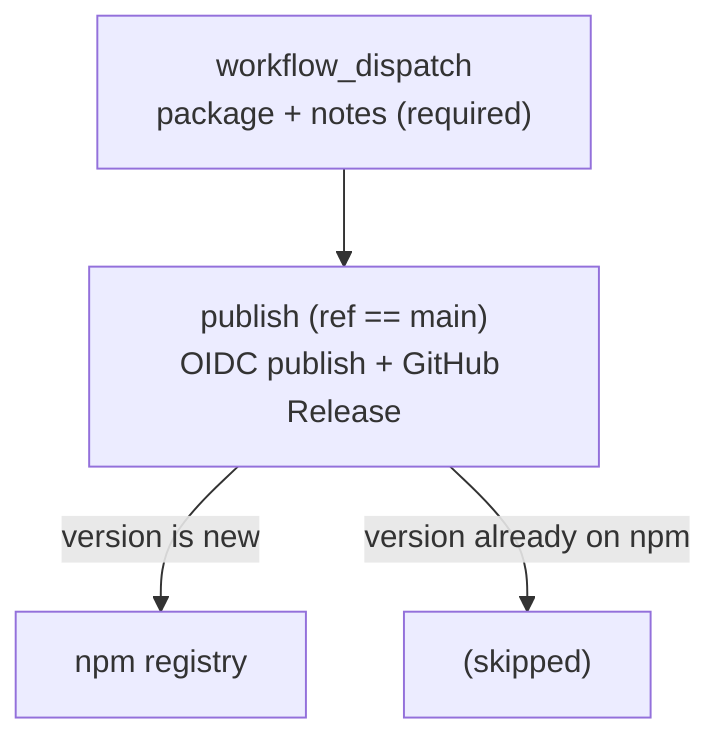

# GitHub Actions workflows

This directory holds the CI/CD pipeline for the `soroush.tech` monorepo. There is
**one** CI workflow for the whole workspace and **three** deployment workflows. The two
deploys (`cd-web`, `cd-worker-api`) are gated on CI success and never run off a raw
`push`; package publishing (`cd-packages`) is **manual `workflow_dispatch` only**.

| File                                       | Name                     | Trigger                                                      |
| ------------------------------------------ | ------------------------ | ------------------------------------------------------------ |
| [`ci.yml`](./ci.yml)                       | `Continuous Integration` | `push` to `main`, every `pull_request`                       |
| [`cd-web.yml`](./cd-web.yml)               | Pages deploy             | `workflow_run` of CI (success, `main`) + `workflow_dispatch` |
| [`cd-worker-api.yml`](./cd-worker-api.yml) | Cloudflare Worker deploy | `workflow_run` of CI (success, `main`) + `workflow_dispatch` |
| [`cd-packages.yml`](./cd-packages.yml)     | Publish Packages (npm)   | manual `workflow_dispatch` only                              |

**Per-workflow deep dives** (every step + caching):
[`ci.md`](./ci.md) · [`cd-web.md`](./cd-web.md) · [`cd-worker-api.md`](./cd-worker-api.md) · [`cd-packages.md`](./cd-packages.md)

## How the pieces fit together

CI runs on every push/PR. On a successful `main` run it uploads a single
[`changes.json`](./ci.md#changesjson) artifact; the **two deploy** workflows then start via
`workflow_run`, download it, and each applies its **own condition** to decide whether to
deploy. `cd-packages` is separate — it's triggered by hand, not by CI, so it reads no
artifact.

Why an artifact? A `workflow_run` event carries no diff base of its own, so the deploy
workflows can't compute what changed. CI already computed it against
`github.event.before..after`, records the answer in `changes.json`, and hands it off
through the artifact. Each deploy reads the file and applies its own condition (e.g. web
deploys on `apps`/`packages`/`root`); the policy lives in CD, the facts in CI. If the
artifact is missing (e.g. a manual `workflow_dispatch`), the deploy falls back to
deploying.

## `ci.yml` — Continuous Integration

A single `prepare` job detects everything once and exposes it as outputs; the heavy
jobs fan out from it and are **gated by change detection** so a package-only PR never
spins up the tri-OS web suite. `ci-ok` is the one stable status check used for branch
protection — it tolerates change-gated jobs being skipped and fails only if a needed
job actually failed or was cancelled.

### `prepare` outputs

Detect once, reuse via `needs.prepare.outputs.*` — node version is always read from
`.nvmrc`, never hard-coded.

| Output                              | Source                                                                                          |
| ----------------------------------- | ----------------------------------------------------------------------------------------------- |
| `node_version`                      | `.nvmrc`                                                                                        |
| `manager` / `command` / `runner`    | presence of `pnpm-lock.yaml` / `yarn.lock` / etc.                                               |
| `playwright_version`                | `@playwright/test` version in `apps/web/package.json` (used in the Playwright binary cache key) |
| `web` / `worker`                    | derived booleans for the CI jobs (own area, a bundled dep, or infra changed)                    |
| `has_packages` / `changed_packages` | the CI `packages` matrix (changed packages, or all on an infra change)                          |

CI also writes the [`changes.json`](./ci.md#changesjson) artifact the CD side reads.

### Change detection

A per-entity `dorny/paths-filter` config is generated from the workspace: one key per
app, worker, package, and workflow file, plus `root` (top-level files only). The
matched keys become the `changes.json` lists. Dependency and infra policy is **not**
baked into the filters — it lives in each consumer's condition (CI gating in
`prepare`, deploy/publish gating in each CD workflow).

### The `web` job (tri-OS)

Runs on `ubuntu-latest`, `windows-latest`, `macOS-latest`. The unit `test` runs on
every OS; coverage tiers and Storybook/Chromatic run only on ubuntu; the E2E browsers
are split across OSes so each engine runs on its native platform (macOS is ~10× the
cost — used only for WebKit).

| Step                       | ubuntu | windows | macOS |
| -------------------------- | :----: | :-----: | :---: |
| Build (`SKIP_PRERENDER`)   |   ✅   |         |       |
| Tests                      |   ✅   |   ✅    |  ✅   |
| Unit coverage → Codecov    |   ✅   |         |       |
| Browser coverage → Codecov |   ✅   |         |       |
| Chromatic + Storybook cov. |   ✅   |         |       |
| E2E Chromium               |   ✅   |         |       |
| E2E Firefox                |        |   ✅    |       |
| E2E WebKit                 |        |         |  ✅   |

The Playwright browser binaries are cached by `runner.os` + Playwright version, with a
fixed `PLAYWRIGHT_BROWSERS_PATH` so one cache path/key works across all three OSes.

### Coverage → Codecov

Each workspace emits its own `coverage/lcov.info` and uploads under its own **flag**;
Codecov merges uploads by commit SHA. 100% coverage is enforced inside each
`vitest.config` — Codecov is for reporting, not the gate.

| Flag                 | Source                              |
| -------------------- | ----------------------------------- |
| `<pkg>` (per matrix) | `packages/<pkg>/coverage/lcov.info` |
| `api`                | `workers/api/coverage/lcov.info`    |
| `unit`               | web unit (jsdom)                    |
| `browser`            | web browser-mode unit               |
| `storybook`          | Storybook test runner               |
| `e2e`                | web Playwright (`coverage/e2e`)     |

## `cd-web.yml` — GitHub Pages deploy

`concurrency: pages` with `cancel-in-progress: false` so deploys queue rather than
abort each other. Build env (Vite vars, GitHub key, Turnstile sitekey) is injected
from repo secrets/vars; `APP_ENV=production`.

## `cd-worker-api.yml` — Cloudflare Worker deploy

`config:gen` renders `wrangler.json` from repo `vars` (worker name, D1, R2, honeypot);
`wrangler deploy` authenticates with `CLOUDFLARE_API_TOKEN` + `CLOUDFLARE_ACCOUNT_ID`.

## `cd-packages.yml` — npm publish

**Manual only** — unlike the other two CD workflows, this one is **not** gated on CI and
never runs off a push, PR merge, or `workflow_run`. It publishes from `workflow_dispatch`,
taking a `package` (choice) and **required** `notes` input.

Publishes the chosen non-`private` package to npm via **Trusted Publishing (OIDC)** — no
long-lived `NPM_TOKEN`; GitHub mints a short-lived id-token per run that npm verifies
against the package's trusted publisher. The publish step skips a version already on the
registry, so **a release is just bumping `package.json` `version` on `main`, then
dispatching**. On a real publish it cuts a GitHub Release tagged `<pkg>@<version>` whose
notes are the **required `notes` input** — no PR or changelog is read. Auto-publish on
merge and required human-written notes can't coexist, so publishing is a deliberate,
on-demand step. See [cd-packages.md](./cd-packages.md) for the full walkthrough.

## Conventions (see the `ci-cd` skill)

- Detect node/package-manager once in `prepare`; reuse via outputs.
- Gate heavy jobs on `dorny/paths-filter` change detection; wire dependency edges by hand.
- `timeout-minutes` on every job; `fail-fast: false` on matrices.
- `cancel-in-progress: true` on CI; **`false`** on the deploy workflows.
- Secrets → `secrets`; non-sensitive config (URLs/IDs/names) → `vars`.
- ubuntu-only except the browser/E2E suite (tri-OS).
