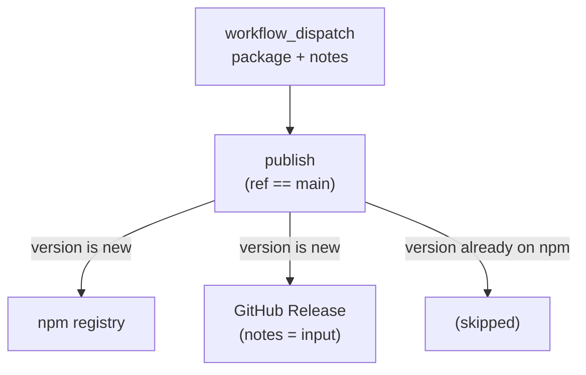

[← Workflows overview](./README.md)

# `cd-packages.yml` — Publish Packages (npm)

Publishes a single `@soroush.tech/*` package to npm via **Trusted Publishing (OIDC)** —
no long-lived `NPM_TOKEN`. **Manual only:** it runs from `workflow_dispatch`, never from a
push, PR merge, or CI completion. A release is a deliberate act, and its GitHub Release
notes are a **required** input — so a package never ships with empty notes.

```yaml
on:
  workflow_dispatch:
    inputs:
      package: # which package to publish
        required: true
        type: choice
        options: [playwright-coverage, styled-system, vite-plugin-msw-server] # generated — see below
      notes: # GitHub Release notes (markdown)
        required: true
        type: string
concurrency:
  group: publish-packages
  cancel-in-progress: false
```

| Field       | Value                                                       |
| ----------- | ----------------------------------------------------------- |
| Triggers    | manual `workflow_dispatch` only (no push / PR / CI trigger) |
| Inputs      | `package` (choice, required), `notes` (string, required)    |
| Concurrency | one `publish-packages` run at a time; queued, not cancelled |

**Why manual?** Auto-publishing on merge and **required, human-written** release notes
can't coexist — at merge time there is no one to write the notes. Choosing required notes
makes publishing an explicit, on-demand step rather than a side effect of a merge.

---

## Job graph



---

## Job: `publish`

`if: github.ref == 'refs/heads/main'` · `environment: cd-packages` · ubuntu · 15 min.
Runs for the one package named in the dispatch.

```yaml
permissions:
  id-token: write # OIDC token for npm Trusted Publishing (no NPM_TOKEN)
  contents: write # create the GitHub Release + tag
```

| #   | Step                 | Detail                                                                                                                                                                                                                                                                                                                       |
| --- | -------------------- | ---------------------------------------------------------------------------------------------------------------------------------------------------------------------------------------------------------------------------------------------------------------------------------------------------------------------------- |
| 1   | Checkout             | `actions/checkout@v5`, no persisted creds                                                                                                                                                                                                                                                                                    |
| 2   | Validate package     | `inputs.package` (read via `$PKG` env, never spliced into shell) must exist under `packages/` and be non-`private`. Defense-in-depth in case the generated choice list is hand-edited or a private dir slips through.                                                                                                        |
| 3   | Read Node.js version | `cat .nvmrc` → `$GITHUB_ENV` (`NODE_VERSION`)                                                                                                                                                                                                                                                                                |
| 4   | Setup pnpm           | `pnpm/action-setup@v5`                                                                                                                                                                                                                                                                                                       |
| 5   | Setup Node           | `actions/setup-node@v5`, `node-version: $NODE_VERSION`, `cache: pnpm` (deps cache), `registry-url: https://registry.npmjs.org`                                                                                                                                                                                               |
| 6   | Install              | `pnpm install --frozen-lockfile`                                                                                                                                                                                                                                                                                             |
| 7   | **Publish**          | `pnpm publish --no-git-checks`, guarded by an `npm view` check that skips a version already on the registry. Auth is the OIDC id-token; **`NODE_AUTH_TOKEN` is never set**. Always sets `name`/`version` outputs + a job-summary line.                                                                                       |
| 8   | **GitHub Release**   | Creates the Release only if it doesn't already exist (`gh release view` check) — gated on the release's existence, not the npm-publish path, so a rerun can repair a missing release after a successful publish. Writes the required `notes` input to a file and runs `gh release create "<name>@<version>" --notes-file …`. |

The dispatch is restricted to `main` (`github.ref`), so a release always comes off the
CI-passed main branch, even though the dispatch UI lets you pick any ref.

---

## Trusted Publishing (OIDC)

Auth is [npm Trusted Publishing](https://docs.npmjs.com/trusted-publishers) — no
`NPM_TOKEN` anywhere. Per run, GitHub mints a short-lived id-token (the
`id-token: write` permission) and npm verifies it against the package's trusted
publisher (repo `soroush-tech/soroush.tech`, workflow `cd-packages.yml`, environment
`cd-packages`). Requirements / gotchas:

- **One-time bootstrap:** a package must exist on npm before a trusted publisher can be
  configured for it, so the **first** publish of a new name is manual (`npm publish`),
  then OIDC takes over.
- **pnpm version:** publish on **pnpm 10.x** (the repo pins `pnpm@10.13.1`) — OIDC is
  currently broken on pnpm 11 ([pnpm#11513](https://github.com/pnpm/pnpm/issues/11513)).
  Needs a modern Node runtime; the repo runs **Node 25** (`.nvmrc`).
- **Never set `NODE_AUTH_TOKEN`:** an empty value makes pnpm attempt token auth instead
  of falling back to OIDC.
- **Release = version bump:** the publish step skips versions already on the registry,
  so a release is just bumping `package.json` `version` on `main`, then dispatching.

---

## Release notes (required dispatch input)

The GitHub Release notes are the **required `notes` input** typed at dispatch time — no
PR, no changelog file, no commit parsing. The job creates a **GitHub Release** tagged
`<package-name>@<version>` (package-scoped so multiple packages don't collide on a plain
`v<version>`) when one doesn't already exist — so a rerun can repair a missing release —
with exactly the notes you provided:

1. `printf '%s' "$NOTES" > release-notes.md` — file form avoids shell-escaping arbitrary
   markdown; `$NOTES` comes from `env`, never spliced into the command.
2. `gh release create "<name>@<version>" --title "<name>@<version>" --notes-file release-notes.md`.

Because the input is `required: true`, a release can never be cut with empty notes. **npm
itself has no release-notes field** — the GitHub Release is the canonical home for notes,
and the package README can link to it.

---

## The `package` choice list

`workflow_dispatch` `choice` options must be literal YAML — GitHub can't populate them from
the repo at dispatch time — so the list is **generated**, not hand-maintained. Between the
`# gen:publish-options start` / `end` markers, `scripts/gen-publish-options.mjs` writes every
non-`private` package under `packages/`, sorted. Regenerate after adding, removing, or
un-`private`-ing a package:

```sh
pnpm gen:publish-options   # rewrites the options block; commit the result
```

The **husky `pre-commit` hook** runs `pnpm gen:publish-options --check` and fails the commit
if the list is stale — so a package can't be added to `packages/` without its dropdown entry
landing in the same change. This is enforced at commit time, not in the workflow: an unlisted
package simply can't be dispatched, and re-checking a listed one during publish would only
catch drift that publishing can't act on.

## Releasing a package

1. Bump the package `version` in `package.json` on `main` (via a normal PR; CI runs).
2. Actions → **Publish Packages (npm)** → **Run workflow** → pick the `package`, paste
   the `notes`, **Run**. CLI equivalent:
   `gh workflow run cd-packages.yml -f package=<dir> -f notes="…"`.
3. The job publishes to npm (skipping if that version is already there) and cuts the
   per-package GitHub Release with your notes.

---

## Caching

Only the **dependency store**, via `setup-node@v5` with `cache: pnpm` — keyed off the
`pnpm-lock.yaml` hash, same mechanism as CI.

---

See also: [ci.md](./ci.md), [cd-web.md](./cd-web.md), [cd-worker-api.md](./cd-worker-api.md),
and the [overview README](./README.md).
