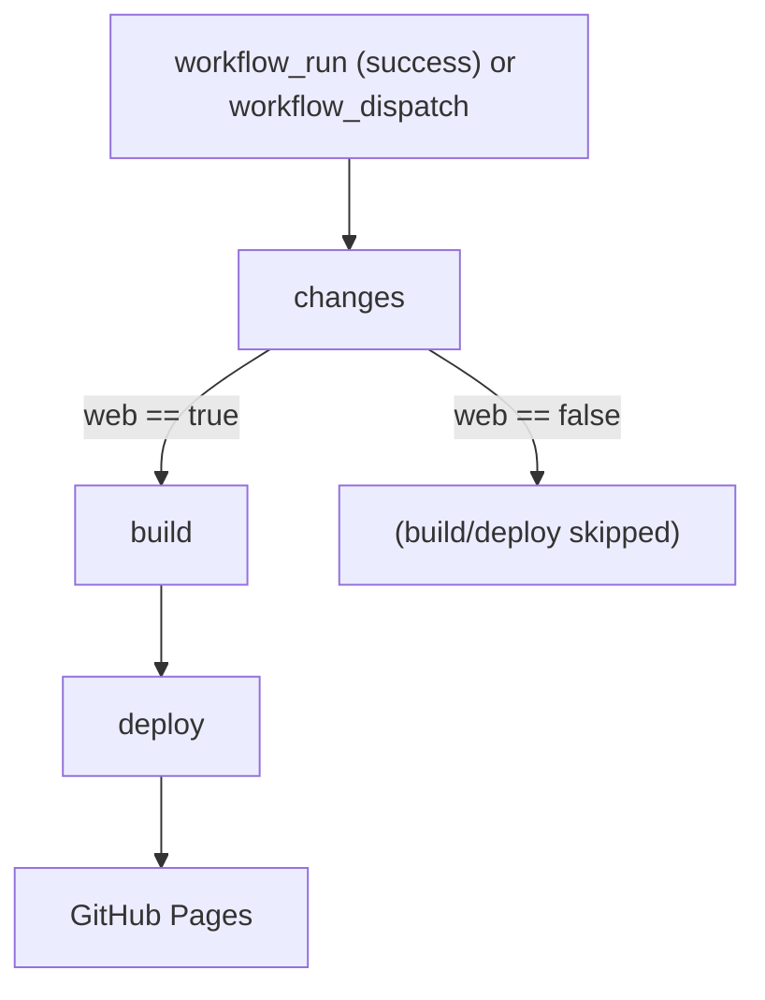

[← Workflows overview](./README.md)

# `cd-web.yml` — Continuous Deployment to GitHub Pages

Builds the web app and deploys it to GitHub Pages. **Gated on CI success** — it starts
from a `workflow_run` of `Continuous Integration`, never from a raw `push`.

```yaml
on:
  workflow_dispatch:
  workflow_run:
    workflows: ['Continuous Integration']
    types: [completed]
    branches: [main]
permissions: { contents: read, pages: write, id-token: write }
concurrency:
  group: 'pages'
  cancel-in-progress: false # let deploys queue, never abort a half-done deploy
```

| Field       | Value                                                                    |
| ----------- | ------------------------------------------------------------------------ |
| Triggers    | `workflow_run` of CI (completed, on `main`) + manual `workflow_dispatch` |
| Permissions | `pages: write` + `id-token: write` (OIDC for `deploy-pages`)             |
| Concurrency | one `pages` deploy at a time; queued, not cancelled                      |

---

## Job graph



---

## Job: `changes`

`runs-on: ubuntu-latest` · `timeout-minutes: 5` · `permissions: { actions: read }`.
Decides whether the web app actually changed.

```yaml
if: ${{ github.event_name == 'workflow_dispatch'
  || github.event.workflow_run.conclusion == 'success' }}
```

| #   | Step                     | Detail                                                                                                                                                                               |
| --- | ------------------------ | ------------------------------------------------------------------------------------------------------------------------------------------------------------------------------------ |
| 1   | Download changes from CI | `actions/download-artifact@v8`, only `if event == workflow_run`, `continue-on-error: true`, `run-id: ${{ github.event.workflow_run.id }}`. Pulls the `changes` artifact CI uploaded. |
| 2   | Decide whether to deploy | shell: if `workflow_dispatch` **or** `changes.json` is missing → `web=true`; else `node` reads it: `web = apps∋'web' \|\| packages≠[] \|\| root` (web bundles the packages).         |

Output: `web` (`'true'`/`'false'`). The missing-file fallback means a manual dispatch
(or any case where the artifact didn't download) deploys rather than silently skips.

---

## Job: `build`

`needs: changes` · `if: needs.changes.outputs.web == 'true'` ·
`environment: github-pages` · ubuntu.

| #   | Step                   | Detail                                                                                                            |
| --- | ---------------------- | ----------------------------------------------------------------------------------------------------------------- |
| 1   | Checkout               | `actions/checkout@v5`                                                                                             |
| 2   | Read Node.js version   | `cat .nvmrc` → `$GITHUB_ENV` (`NODE_VERSION`); fails if `.nvmrc` is missing                                       |
| 3   | Detect package manager | shell `if` on lockfile → `manager` / `command` / `runner`                                                         |
| 4   | Setup pnpm             | `pnpm/action-setup@v5`, `if manager == 'pnpm'`                                                                    |
| 5   | Setup Node             | `actions/setup-node@v5`, `node-version: $NODE_VERSION`, `cache: <manager>` (deps cache — see [Caching](#caching)) |
| 6   | Install                | `${manager} ${command}`                                                                                           |
| 7   | Build project          | `${runner} run build` with the production env below                                                               |
| 8   | Upload artifact        | `actions/upload-pages-artifact@v3`, `path: ./apps/web/build/client`                                               |

Build env (from repo `secrets`/`vars`):

| Var                      | Kind    | Purpose                           |
| ------------------------ | ------- | --------------------------------- |
| `VITE_BASE_URL`          | var     | site base URL                     |
| `VITE_GITHUB_KEY`        | secret  | GitHub API token for gist fetches |
| `VITE_API_URL`           | var     | worker API base                   |
| `VITE_CONTACT_HONEYPOT`  | var     | contact-form honeypot field name  |
| `VITE_TURNSTILE_SITEKEY` | secret  | Turnstile widget sitekey          |
| `CODECOV_TOKEN`          | secret  | present for parity                |
| `APP_ENV`                | literal | `production`                      |

---

## Job: `deploy`

`needs: build` · ubuntu · `environment: github-pages` (URL surfaced from the deploy
step output).

| #   | Step                   | Detail                                                                                              |
| --- | ---------------------- | --------------------------------------------------------------------------------------------------- |
| 1   | Deploy to GitHub Pages | `actions/deploy-pages@v4` (id `deployment`); publishes the uploaded artifact and returns `page_url` |

---

## Caching

Only the **dependency store** is cached, via `setup-node@v5` with `cache: <manager>`
in the `build` job — keyed off the `pnpm-lock.yaml` hash, same mechanism as CI. There
is no Playwright cache here (no browser tests run during deploy), and the Pages
artifact is a one-shot upload, not a cache.

---

See also: [ci.md](./ci.md), [cd-worker-api.md](./cd-worker-api.md), and the
[overview README](./README.md).
