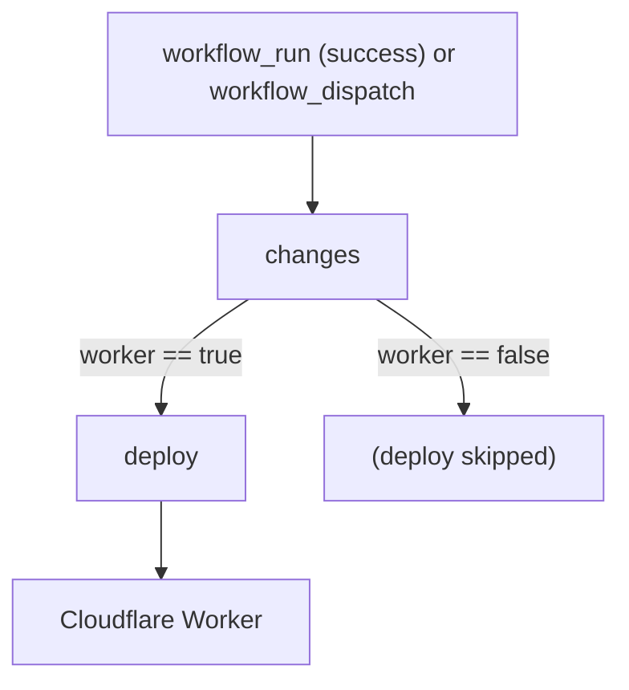

[← Workflows overview](./README.md)

# `cd-worker-api.yml` — Deploy Worker (`@soroush/api`)

Deploys the Cloudflare Worker API. **Gated on CI success** — starts from a
`workflow_run` of `Continuous Integration`, never from a raw `push`.

```yaml
on:
  workflow_dispatch:
  workflow_run:
    workflows: ['Continuous Integration']
    types: [completed]
    branches: [main]
concurrency:
  group: deploy-worker-api
  cancel-in-progress: false # never abort an in-flight deploy
```

| Field       | Value                                                                    |
| ----------- | ------------------------------------------------------------------------ |
| Triggers    | `workflow_run` of CI (completed, on `main`) + manual `workflow_dispatch` |
| Concurrency | one `deploy-worker-api` at a time; queued, not cancelled                 |

---

## Job graph



---

## Job: `changes`

`runs-on: ubuntu-latest` · `timeout-minutes: 5` · `permissions: { actions: read }`.

```yaml
if: ${{ github.event_name == 'workflow_dispatch'
  || github.event.workflow_run.conclusion == 'success' }}
```

| #   | Step                     | Detail                                                                                                                                                                   |
| --- | ------------------------ | ------------------------------------------------------------------------------------------------------------------------------------------------------------------------ |
| 1   | Download changes from CI | `actions/download-artifact@v8`, only `if event == workflow_run`, `continue-on-error: true`, `run-id: ${{ github.event.workflow_run.id }}`. Pulls the `changes` artifact. |
| 2   | Decide whether to deploy | shell: if `workflow_dispatch` **or** `changes.json` is missing → `worker=true`; else `node` reads it: `worker = worker∋'api' \|\| packages∋'schema' \|\| root`.          |

Output: `worker` (`'true'`/`'false'`). The worker consumes `@soroush.tech/schema`, so
a `schema` package change also flips this to `true`.

---

## Job: `deploy`

`needs: changes` · `if: needs.changes.outputs.worker == 'true'` ·
`environment: cd-worker` · ubuntu.

| #   | Step                              | Detail                                                                                                       |
| --- | --------------------------------- | ------------------------------------------------------------------------------------------------------------ |
| 1   | Checkout                          | `actions/checkout@v5`                                                                                        |
| 2   | Read Node.js version              | `cat .nvmrc` → `$GITHUB_ENV` (`NODE_VERSION`)                                                                |
| 3   | Setup pnpm                        | `pnpm/action-setup@v5`                                                                                       |
| 4   | Setup Node                        | `actions/setup-node@v5`, `node-version: $NODE_VERSION`, `cache: pnpm` (deps cache — see [Caching](#caching)) |
| 5   | Install                           | `pnpm install --frozen-lockfile`                                                                             |
| 6   | Generate `wrangler.json` from env | `pnpm --filter @soroush/api config:gen` — renders the wrangler config from repo `vars`                       |
| 7   | Deploy                            | `pnpm --filter @soroush/api exec wrangler deploy`                                                            |

`config:gen` env (`vars`): `WORKER_NAME`, `D1_DATABASE_NAME`, `D1_DATABASE_ID`,
`R2_BUCKET`, `VITE_CONTACT_HONEYPOT`.

Deploy env: `CLOUDFLARE_API_TOKEN` (`secret`), `CLOUDFLARE_ACCOUNT_ID` (`var`).

Why generate the config at deploy time: `wrangler.json` carries environment-specific
IDs (D1, R2, account) that live in repo `vars`/`secrets` rather than in the repo, so
it's rendered fresh instead of committed.

---

## Caching

Only the **dependency store**, via `setup-node@v5` with `cache: pnpm` — keyed off the
`pnpm-lock.yaml` hash, same mechanism as CI. No browser or build-artifact caches.

---

See also: [ci.md](./ci.md), [cd-web.md](./cd-web.md), and the
[overview README](./README.md).
